# Task5Logger

Keep track of stuff you do everyday. [https://tasklogger.netlify.app/](https://tasklogger.netlify.app/)

Made with [React](https://react.dev/), [Sanity](https://www.sanity.io/), [Auth0](https://auth0.com/) and [Netlify](https://www.netlify.com/). Icons created by Freepik from [Flaticon](https://www.flaticon.com/).

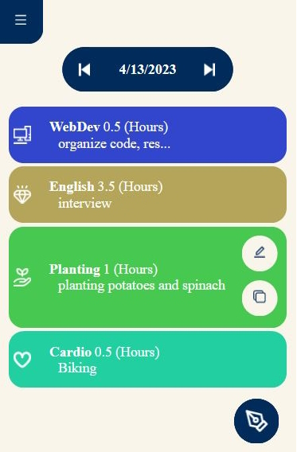 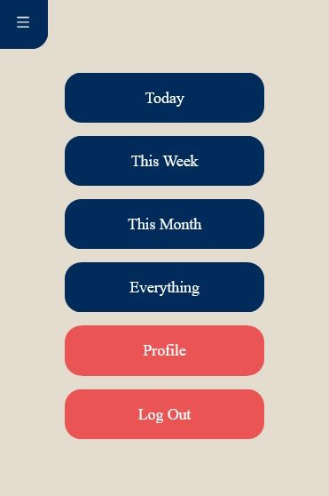

See everything you've done by day, week, month, or all at the same time.

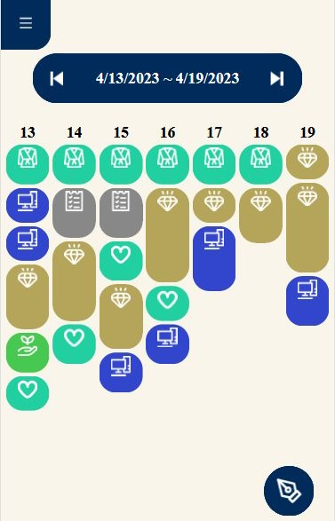 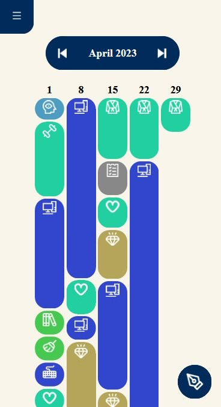

Create different tasks and categories.

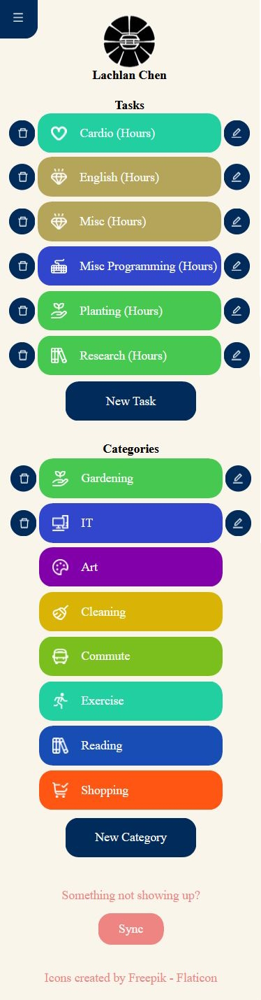 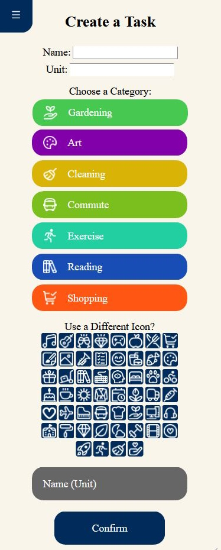 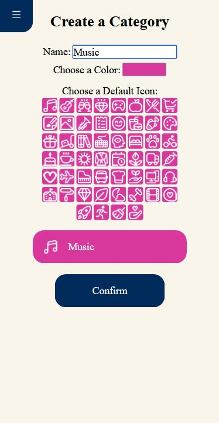

Edit or Clone with these two buttons.

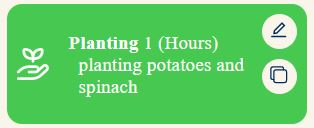

Search for specific keywords and Filter out Tasks or Categories

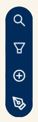 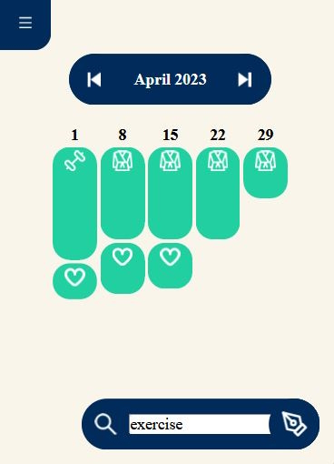 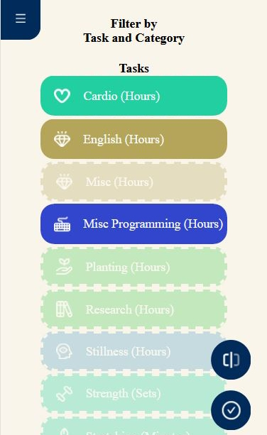
